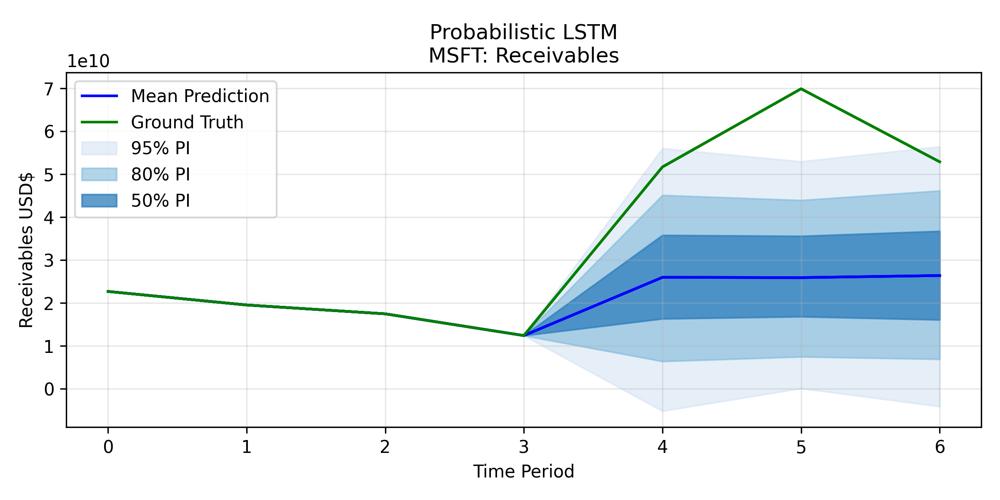
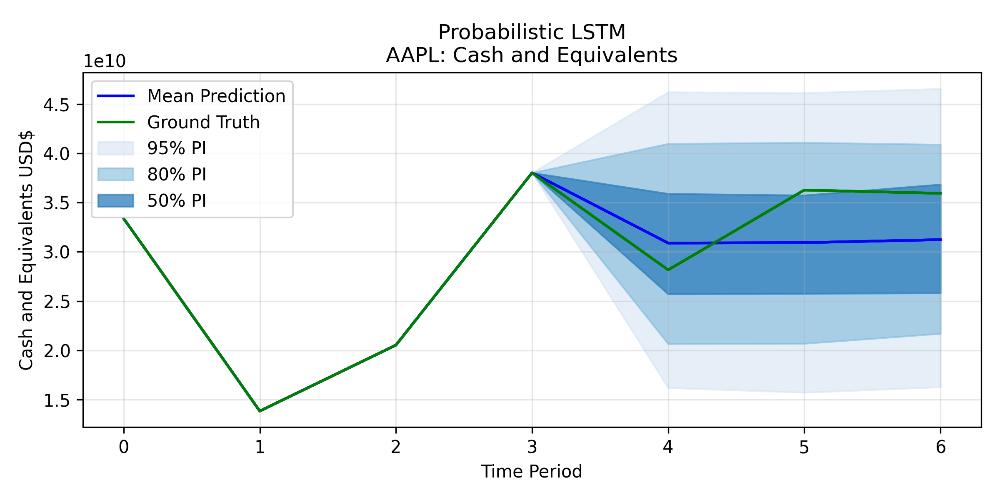

# JPM - MLCOE Internship Exercises

<p align="center">
  <a href="https://www.linkedin.com/in/tavisshore/">
    
  </a>
  &nbsp;&nbsp;&nbsp;
  <a href="https://www.linkedin.com/in/sanaamironov/">
    
  </a>
</p>

## Setup
Create a clean Python 3.10 environment and install the package:
```bash
conda create -n jpm python=3.10
conda activate jpm
pip install -e . # .[dev] <- for pytest etc.

# Optional testing
pytest -v
```


## Question 1 - Financial Statement Forecasting
***Environment Variables***

If you want to download further data or use the LLM services, you will need to add your own keys for the following APIs - otherwise the remaining scripts work fully with the offline data stored in assets/.

**Required** - this is currently essential to run the scripts, but the other APIs are optional.
EDGAR requires an email for SEC downloads:
```bash
export EDGAR_EMAIL="your_email@address.com"
```

(Optional) The LLM clients require API keys (currently only OpenAI is compatible):
```bash
export OPENAI_API_KEY="your_api_key"
```

(Optional) When parsing non-USD annual reports, we use `https://www.exchangerate-api.com/` to retrieve FX rates for the report date - this must be set to accurately parse non-USD reports - otherwise it falls back to innacurate static annual values.
```bash
export FX_API_KEY='your_fx_api_key'
```

#### Configuration
**View Available Arguments:**
Accessible for any Question 1 scripts, using parse_reports.py here as an example. (lstm.py is an evaluation - alter it's config in file)
```bash
python scripts/question_1/ml/parse_reports.py --help       # Show all arguments
python scripts/question_1/ml/parse_reports.py --help data  # Show only DataConfig arguments
python scripts/question_1/ml/parse_reports.py --help lstm  # Show only LSTMConfig arguments
python scripts/question_1/ml/parse_reports.py --help llm   # Show only LLMConfig arguments
```

#### Downloading Data
This script download data for tickers in jpm.utils - selectable by industry or __all__.
```bash
python scripts/question_1/download_data.py --cache-dir 'DATA_LOCATION'
# Example optional args: --industry tech --total-ticker -1
```
This will take quite a long time but shows progress and a time estimate.

### Part 1
- **Vélez-Pareja:**
  The models below are constructed following the cited academic papers - outputs match those in the papers.
  - **Plugless:** from the paper *Forecasting Financial Statements with No plugs and No Circularity* [1]
    ```bash
    python scripts/question_1/valez/noplug.py
    ```
  - **Consistent:** from the paper *Constructing Consistent Financial Planning Models for Valuation* [2]
    ```bash
    python scripts/question_1/valez/construct.py    # <- pd.series model
    python scripts/question_1/valez/construct_tf.py # <- TF model
    ```

- **Deterministic / Variational / Probabilistic LSTMs**
  - Update `CONFIG_VARIATIONS` for desired evaluations, again tickers may be selected by industry or __all__.
  - Accounting identity can be encouraged through the identity loss:   `learn_identity = True`
  - It can also be enforced (only compatible with deterministic LSTM): `enforce_balance = True`
  - **Seasonality Weighting**
    - The system adds a seasonality weighting to data: `seasonal_weight = 1.1`
    - Or a **Temporal Attention** layer learns the optimal weight: `learnable_seasonal_weight = True`

  N.B. Ground truth currently shows as $0 when predicting future quarter but it is of course unknown.

  ```bash
  python scripts/question_1/ml/lstm.py --industry tech
  ```

    Two examples of the probabilistic LSTM results, estimating the unseen test set's quarters - single feature plots.

  <p align="center">
    
    
  </p>

  More result plots and data files are available in `results/`.

### Part 2
- **Ensemble model:**
    The LLM can be used to either adjust the LSTM estimation, or independently predict the future financial statement features before combining the output with the LSTM.
    ```bash
    python scripts/question_1/ml/ensemble.py
    ```

- **Annual Report Parsing:**
    This script uses the same LLM client to parse pdf annual reports, extracting key financial information. Available reports are stored within `assets/`
    (the argument for parsing is `ticker` although it's the name - to be compatible throughout the config)
    ```bash
    python scripts/question_1/ml/parse_reports.py --ticker msft
    # Options: --ticker [alibaba, exxon, evergrande, ...]
    ```
#### Part B: Bonus 1
- **Credit Rating:**
    This script trains an XGBoost model on credit ratings data constructed from our SEC data and `ratingshistory.info` before giving a credit prediction to your ticker argument.
    ```bash
    python scripts/question_1/ml/pipeline.py --ticker msft
    # Options: --ticker [alibaba, exxon, evergrande, ...]
    ```

    Or for just XGBoost training and evaluation - not requiring any API access.
    ```bash
    python scripts/question_1/ml/xgb.py
    # Options: --ticker [alibaba, exxon, evergrande, ...]
    ```


## Question 3 (Discrete Choice Models)
The solution to **Question 3** is located under:
 ```bash
src/jpm/question_3/
```
All runnable scripts are executed from the **repository root** using paths under:
```bash
scripts/question_3/
```

Please see `src/jpm/question_3/readme.md` for full instructions.

The hybrid model that combines Zhang et al. (2025) DeepHalo with Lu & Shimizu (2025) sparse market–product shocks is implemented in the following folder:
```bash
  src/jpm/question_3/deephalo_extension/zhang_sparse_choice_learn.py
```
This is part 2

## Citations
```
[1] Velez-Pareja, Ignacio, Forecasting Financial Statements with No Plugs and No Circularity (May 22, 2012). The IUP Journal of Accounting Research & Audit Practices, Vol. X, No. 1, 2011, Available at SSRN: https://ssrn.com/abstract=1031735
[2] Velez-Pareja, Ignacio, Constructing Consistent Financial Planning Models for Valuation (August 15, 2009). IIMS Journal of Management of Science, Vol. 1, January-June 2010, Available at SSRN: https://ssrn.com/abstract=1455304
```
